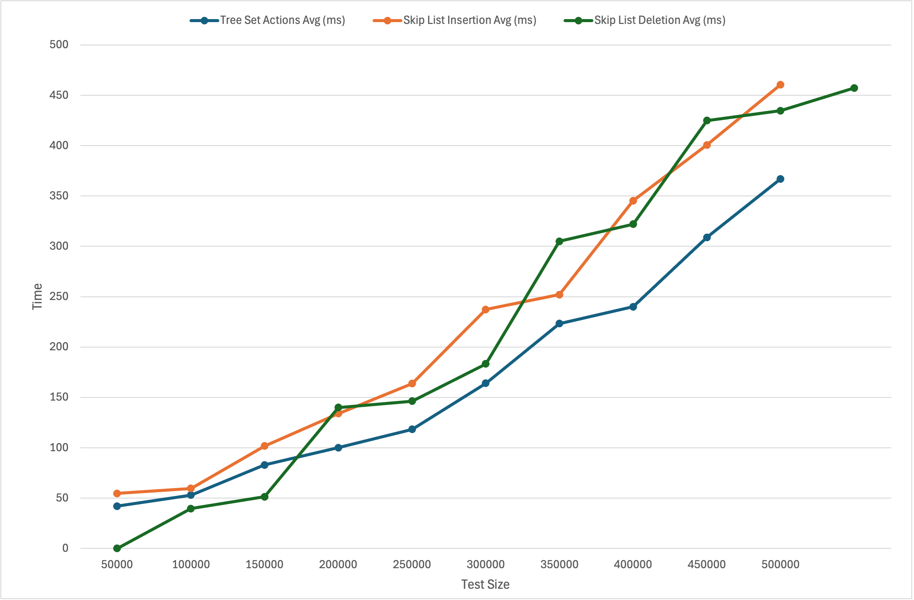

Got it. Let's reorganize your project directory and update the commands accordingly. Here is the updated directory structure and the commands to move the files.

### Directory Structure

```
Lab-5/
│
├── .vscode/
│   └── launch.json
│
├── src/
│   ├── Main.java
│   └── node.java
│
├── bin/
│   ├── Main.class
│   └── node.class
│
├── data/
│   ├── output1.txt
│   ├── output2.txt
│   ├── output3.txt
│   ├── results.csv
│   └── results.xlsx
│
├── images/
│   └── performance.png
│
├── scripts/
│   └── merge_outputs_to_csv.py
│
├── .DS_Store
├── README.md
```

### Commands to Move the Files

```bash
cd /Users/beck/GitHub/myRepos/Lab-5

# Create the directory structure
mkdir -p src bin data images scripts

# Move the files into their respective directories
mv Main.java src/
mv Main.class bin/
mv node.class bin/
mv output1.txt data/
mv output2.txt data/
mv output3.txt data/
mv results.csv data/
mv results.xlsx data/
mv performance.png images/
mv merge_outputs_to_csv.py scripts/
```

### Update Your README.md with the New Structure

Update the README.md to reflect the new directory structure. The previous README.md content can be reused but adjusted to point to the new file paths.

---

## README.md

# Skip List and Tree Set Performance Comparison

This project compares the performance of Skip List and Tree Set data structures in Java. The primary focus is on measuring the time taken for insertion, deletion, and total actions for various test sizes. The results are analyzed and visualized using Excel.

## Table of Contents

- [Introduction](#introduction)
- [Java Program Explanation](#java-program-explanation)
- [Setup and Compilation](#setup-and-compilation)
- [Running the Experiments](#running-the-experiments)
- [Data Processing](#data-processing)
- [Visualization in Excel](#visualization-in-excel)
- [Conclusion](#conclusion)

## Introduction

In this project, we implemented and compared the performance of Skip List and Tree Set data structures. We conducted experiments by inserting and deleting elements in both data structures and measured the time taken for these operations. The results were then plotted to visualize the differences in performance.

## Java Program Explanation

The Java program consists of a Skip List implementation and performance comparison with Tree Set. Here is a breakdown of the main components:

1. **Node Class**: Represents a node in the skip list with data, next, previous, up, and down pointers.
    ```java
    class node {
        public int data;
        public node next;
        public node prev;
        public node up;
        public node down;
        public int level;

        public node(int myval, int mylev) {
            data = myval;
            level = mylev;
            next = null;
            prev = null;
            up = null;
            down = null;
        }
    }
    ```

2. **Main Class**: Contains the skip list implementation and the performance testing logic.
    - **buildLevel**: Creates a new level in the skip list.
    - **search**: Searches for a value in the skip list and returns a list of nodes preceding the value at each level.
    - **insert**: Inserts a value into the skip list.
    - **delete**: Deletes a value from the skip list.
    - **connectLastLevel**: Connects the newly added level to the rest of the skip list.
    - **largeTestRandom**: Conducts the performance test by inserting and deleting elements in both skip list and tree set, and measures the time taken.

3. **Performance Test**:
    - Generates random integers for insertion and deletion.
    - Measures the time taken for insertion and deletion operations in both skip list and tree set.
    - Prints the results for each test size.

## Setup and Compilation

### Cloning the Repository
```bash
git clone https://github.com/Izaacapp/Lab-5.git
cd Lab-5
```

### Compiling the Java Program
```bash
javac -d bin src/*.java
```

### Running the Java Program to Generate Output Files
```bash
java -cp bin Main > data/output1.txt
java -cp bin Main > data/output2.txt
java -cp bin Main > data/output3.txt
```

## Running the Experiments

1. **Run the program three times to generate the output files**. Each run will produce an output file (`output1.txt`, `output2.txt`, `output3.txt`) containing the timing data for different test sizes.

2. **Sample Output (Partial)**:
    ```
    Test size: 50000
    ======
    Skip list insertion took 54 ms.
    Skip list deletion took 40 ms.
    Skip list actions took 94 ms.
    Tree set insertion took 24 ms.
    Tree set deletion took 18 ms.
    Tree set actions took 42 ms.
    ...
    ```

## Data Processing

To process the output files and generate a CSV file for easy import into Excel, we used a Python script. The script reads the output files, calculates the average times for insertion, deletion, and total actions, and writes the results to a CSV file.

### Python Script (`scripts/merge_outputs_to_csv.py`):
```python
import re
import csv

# Regular expressions to match the output lines
size_re = re.compile(r'Test size: (\d+)')
skip_list_insert_re = re.compile(r'Skip list insertion took (\d+) ms.')
skip_list_delete_re = re.compile(r'Skip list deletion took (\d+) ms.')
skip_list_action_re = re.compile(r'Skip list actions took (\d+) ms.')
tree_set_insert_re = re.compile(r'Tree set insertion took (\d+) ms.')
tree_set_delete_re = re.compile(r'Tree set deletion took (\d+) ms.')
tree_set_action_re = re.compile(r'Tree set actions took (\d+) ms.')

def process_file(filename):
    data = []
    with open(filename, 'r') as infile:
        test_size = None
        skip_list_insert = None
        skip_list_delete = None
        skip_list_actions = None
        tree_set_insert = None
        tree_set_delete = None
        tree_set_actions = None

        for line in infile:
            size_match = size_re.match(line)
            if size_match:
                test_size = int(size_match.group(1))
            skip_list_insert_match = skip_list_insert_re.match(line)
            if skip_list_insert_match:
                skip_list_insert = int(skip_list_insert_match.group(1))
            skip_list_delete_match = skip_list_delete_re.match(line)
            if skip_list_delete_match:
                skip_list_delete = int(skip_list_delete_match.group(1))
            skip_list_action_match = skip_list_action_re.match(line)
            if skip_list_action_match:
                skip_list_actions = int(skip_list_action_match.group(1))
            tree_set_insert_match = tree_set_insert_re.match(line)
            if tree_set_insert_match:
                tree_set_insert = int(tree_set_insert_match.group(1))
            tree_set_delete_match = tree_set_delete_re.match(line)
            if tree_set_delete_match:
                tree_set_delete = int(tree_set_delete_match.group(1))
            tree_set_action_match = tree_set_action_re.match(line)
            if tree_set_action_match:
                tree_set_actions = int(tree_set_action_match.group(1))

            # When all data for a test size is found, store it in the list
            if all([test_size, skip_list_insert, skip_list_delete, skip_list_actions, tree_set_insert, tree_set_delete, tree_set_actions]):
                data.append({
                    'test_size': test_size,
                    'skip_list_insert': skip_list_insert,
                    'skip_list_delete': skip_list_delete,
                    'skip_list_actions': skip_list_actions,
                    'tree_set_insert': tree_set_insert,
                    'tree_set_delete': tree_set_delete,
                    'tree_set_actions': tree_set_actions
                })
                test_size = None
                skip_list_insert = None
                skip_list_delete = None
                skip_list_actions = None
                tree_set_insert = None
                tree_set_delete = None
                tree_set_actions = None
    return data

# Process all output files
data1 = process_file('data/output1.txt')
data2 = process_file('data/output2.txt')
data3 = process_file('data/output3.txt')

# Merge the data and calculate averages
merged_data = []
for entry1, entry2, entry3 in zip(data1, data2, data3):
    test_size = entry1['test_size']
    merged_data.append({
        'test_size': test_size,
        'skip_list_insert_avg': (entry1['skip_list_insert'] + entry2['skip_list_insert'] + entry3['skip_list_insert']) / 3,
        'skip_list_delete_avg': (entry1['skip_list_delete'] + entry2['skip_list_delete'] + entry3['skip_list_delete']) / 3,
        'skip_list_actions_avg': (entry1['skip_list_actions'] + entry2['skip_list_actions'] + entry3['skip_list_actions']) / 3,
        'tree_set_insert_avg': (entry1['tree_set_insert'] + entry2['tree_set_insert'] + entry3['tree_set_insert']) / 3,
        'tree_set_delete_avg': (entry1['tree_set_delete

'] + entry2['tree_set_delete'] + entry3['tree_set_delete']) / 3,
        'tree_set_actions_avg': (entry1['tree_set_actions'] + entry2['tree_set_actions'] + entry3['tree_set_actions']) / 3
    })

# Write the merged data to a CSV file
with open('data/results.csv', 'w', newline='') as csvfile:
    fieldnames = ['Test Size', 'Skip List Insertion Avg (ms)', 'Tree Set Insertion Avg (ms)', 'Skip List Deletion Avg (ms)', 'Tree Set Deletion Avg (ms)', 'Skip List Actions Avg (ms)', 'Tree Set Actions Avg (ms)']
    writer = csv.DictWriter(csvfile, fieldnames=fieldnames)

    writer.writeheader()
    for data in merged_data:
        writer.writerow({
            'Test Size': data['test_size'],
            'Skip List Insertion Avg (ms)': data['skip_list_insert_avg'],
            'Tree Set Insertion Avg (ms)': data['tree_set_insert_avg'],
            'Skip List Deletion Avg (ms)': data['skip_list_delete_avg'],
            'Tree Set Deletion Avg (ms)': data['tree_set_delete_avg'],
            'Skip List Actions Avg (ms)': data['skip_list_actions_avg'],
            'Tree Set Actions Avg (ms)': data['tree_set_actions_avg']
        })
```

### Visualization in Excel

1. **Open Excel and import `results.csv`.**
2. **Create three line charts:**

#### Insertion Time Comparison
- Highlight the `Test Size`, `Skip List Insertion Avg (ms)`, and `Tree Set Insertion Avg (ms)` columns.
- Insert a Line Chart.
- Title: `Insertion Time Comparison`
- X-axis: `Test Size`
- Y-axis: `Time (ms)`

#### Deletion Time Comparison
- Highlight the `Test Size`, `Skip List Deletion Avg (ms)`, and `Tree Set Deletion Avg (ms)` columns.
- Insert a Line Chart.
- Title: `Deletion Time Comparison`
- X-axis: `Test Size`
- Y-axis: `Time (ms)`

#### Total Time Comparison
- Highlight the `Test Size`, `Skip List Actions Avg (ms)`, and `Tree Set Actions Avg (ms)` columns.
- Insert a Line Chart.
- Title: `Total Time Comparison`
- X-axis: `Test Size`
- Y-axis: `Time (ms)`

### Example Chart
 

### Conclusion

This project demonstrates the performance differences between Skip List and Tree Set data structures. By analyzing insertion, deletion, and total times across various test sizes, we can conclude that Tree Set generally outperforms Skip List in terms of efficiency for the given operations.

